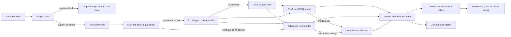

# Relay — intelligent support desk

Relay is a customer support desk with a visible routing dispatcher. Its **recommended setup uses local Ollama models and no paid API calls**. It answers routine questions from approved policies, sends difficult questions to a stronger local model, and uses a deterministic fallback if a model fails. The app has a customer chat and a company decision monitor, plus conversation replay, human review tickets, a cost comparison, and a human feedback workflow.

## Local-first design

Relay is published in a public repository without private API keys. Its default configuration runs routing and customer answers through local Ollama models rather than requiring separate hosted-provider credentials. These are real local model calls: `qwen3:1.7b` handles routine questions and routing, while `deepseek-r1:8b` handles complex cases. The outage switch simulates a provider failure so the deterministic fallback can be observed. Optional hosted adapters remain disabled in free mode, and `.env` is excluded from Git.

## Run it

Requirements: Node.js 20 or newer and [Ollama](https://ollama.com/download/windows) with enough RAM and disk space for the two models. No npm installation or API key is needed. In PowerShell:

```powershell
Copy-Item .env.example .env
ollama pull qwen3:1.7b
ollama pull deepseek-r1:8b
node server.mjs
```

With Ollama running, the app is available at [http://localhost:3000](http://localhost:3000) and displays **FREE LOCAL MODELS**. Conversations, feedback, preference pairs, and tickets are stored in `data/support.json`. Without the `.env` copy or downloaded models, the interface runs in **FREE DEMO MODE** with deterministic example answers.

`node scripts/seed-live-demo.mjs` populates a fresh local store while the server is running. It creates six conversations covering routine FAQs, an unsupported address change, a contract escalation, a simulated outage, and an unrelated coding request. It also creates two ratings, one reviewed preference pair, and a human-review ticket, then checks replay. The questions are synthetic examples; the model responses and recorded latencies come from live local calls. The script adds data and does not clear an existing store. `data/` is ignored by Git.

The supplied `.env.example` selects these models:

- `qwen3:1.7b` makes a typed local-versus-advanced routing choice and answers routine FAQs.
- `deepseek-r1:8b` handles complex cases, grounded in the example policies.
- A scope guardrail redirects unrelated requests such as coding questions without calling a model. Contract disputes and support questions with no matching policy go to the advanced path.

The small and advanced models can be changed through `OLLAMA_MODEL` and `OLLAMA_ADVANCED_MODEL`. Model downloads use disk space and bandwidth, and local inference uses electricity, but these paths have no metered API charge. If a model call fails, the trace records the failure and the response uses verified policy text or asks for human review. Routine model answers must cite an approved source ID or they are rejected. The routine answer model receives only the top matching policy to reduce cross-policy mixing.

`SUPPORT_MODE=free` is the default and ignores OpenAI and Jev keys even if they are present. A NVIDIA NIM key is **not required or read**. `SUPPORT_MODE=external` and `ROUTER_PROVIDER=jev` enable optional hosted APIs and may incur charges. Jev returns typed decisions rather than customer-facing answers, as described in the [TypeSafe API reference](https://docs.typesafe.ai/api).

## Example workflows

- **Routine FAQ:** “When will my refund arrive?” is answered by the small local model with an approved policy citation.
- **Complex case:** “My signed contract contradicts your refund policy” takes the advanced local route and offers human review instead of deciding a contract dispute.
- **Outage recovery:** The **Simulate advanced outage** switch triggers a recorded provider failure and a deterministic fallback response.
- **Decision replay:** **Replay this conversation** recalculates routes at a selected threshold and compares estimated model work and latency.
- **Feedback and handoff:** Customer ratings feed a review queue, preferred answers can be exported as JSONL, and human review requests appear as tickets.
- **Scope control:** An unrelated request such as “Can you write code to add 2 numbers?” receives a support-topic redirect without a model call.

## Architecture



`lib/knowledge.mjs` contains the example policies and retrieval terms. `lib/router.mjs` calculates a source-match score and applies sensitive-case rules. `lib/local-decision.mjs` asks the small Ollama model for a typed route and validates the result. `lib/providers.mjs` contains the Ollama answer adapters and deterministic fallback. `server.mjs` exposes the API and stores decision traces. `public/` contains the customer chat and company monitor, replay, knowledge, and feedback views. `lib/jev.mjs` remains an optional hosted adapter.

The source-match score is a **heuristic**, not a calibrated probability. The local model chooses a route, while the score and guardrails control whether a routine answer is safe to use. The scope check redirects unrelated tasks before any answer model runs. Sensitive terms such as contracts, legal disputes, and exceptions force advanced routing. Support questions with no matching policy also go directly to the advanced path. If a local model times out or returns an invalid choice, rules take over and the trace records the error. Production use requires approved policies and evaluation on representative support data.

## Replay and cost calculations

Replay reads saved customer messages and recomputes their route at the selected threshold. It reuses saved model decisions and makes **no model calls**. In free mode, the baseline uses the large local model for every message. The comparison shows relative model work units and illustrative answer latency; both paths have $0 API charges. Work units count the routing call when a local model made one, then weight the large model at four times the small model. These are based on approximate model size and token count, **not measured energy use or an actual bill**. Routing latency is excluded. The original response and failure state remain in the trace for comparison.

The **Cost comparison** in Insights uses saved answer traces. Its hypothetical baseline sends every recorded question to a paid model at an **assumed** blended price of $2 per million tokens. Tokens are estimated from question and answer text length at four characters per token plus 120 tokens per answer. Relay's API charges come from the saved trace estimates; free local mode records $0 API charges. The dashboard shows baseline, Relay API charges, avoided charges, and an extrapolation to 10,000 questions with the same mix. These figures are illustrative, not measured bills or a current provider price. The comparison excludes local hardware and electricity, hosted router charges, and staff time. A small demo sample is not a reliable production savings forecast.

## Human feedback and RLHF path

- Customers rate answers helpful or unhelpful and may add a reason.
- Reviewers see low-rated answers alongside the original customer question and write a preferred answer.
- The **Export preference dataset** link returns JSONL records with `prompt`, `chosen`, `rejected`, and `source_ids` fields.
- These pairs can be reviewed, split into train/evaluation sets, and used for offline preference optimization of the local model. This project does **not** automatically run RLHF training or deploy a tuned checkpoint. Until enough reviewed data exists, corrections to policies and routing rules are the safer improvement path.

## Verification

```powershell
node --test
node scripts/evaluate.mjs
```

The automated journey covers a local FAQ answer, an unrelated coding request, simulated advanced-model failure, safe fallback, replay, negative feedback, preference export, and ticket creation. Local-choice tests use controlled Ollama responses to verify routing, escalation, guardrails, outage fallback, and replay. The evaluation set in `eval/cases.json` has 23 routine, ambiguous, exception, unknown-policy, and unrelated questions. At the current threshold, all 23 match their expected rule route and specified top source. This curated set demonstrates the routing mechanism; it does not establish production accuracy or answer quality. The live local routes were also checked with Ollama.

## Current limits

- The included policies are fictional examples. A real support desk would require approved, versioned documents.
- Ollama and the named models must be installed to run local inference.
- Jev and OpenAI are disabled in free mode. The Jev adapter has contract tests but no live provider validation in this checkout.
- The local answer guard checks for a source ID but cannot prove every generated claim is supported. Human review remains necessary for sensitive cases.
- The scope guard is a lightweight rule set and may misclassify unusual wording; broader evaluation is needed before public use.
- Tickets are stored in the local app; no email or external helpdesk integration is included.
- The server binds to localhost and has no accounts or access control. Public deployment would require authentication, data retention controls, and a persistent managed database.
- The customer and company views are a demo switch within one local app. They are not separate authenticated roles. The monitor polls high-level active stages every two seconds and then shows the saved trace after the response finishes. Short stages may finish between polls; internal model tokens are not streamed.
