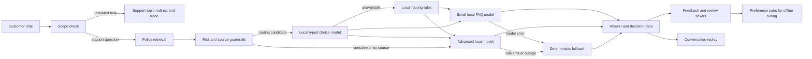

# Relay — intelligent support desk

Relay is a customer support desk with a visible routing dispatcher. Its **recommended setup uses local Ollama models and no paid API calls**. It answers routine questions from approved policies, sends difficult questions to a stronger local model, and uses a deterministic fallback if a model fails. The app has a customer chat and a company decision monitor, plus conversation replay, human review tickets, a cost comparison, and a human feedback workflow.

For the short judge setup and demo sequence, see [SUBMISSION.md](SUBMISSION.md).

## Public-repository demo choice

This hackathon solution is submitted in a public repository, so it does not include or require private API keys. Instead of depending on separate hosted-provider credentials, the default setup runs the routing and customer answers with free local Ollama models. These are real local model calls: `qwen3:1.7b` handles routine questions and routing, while `deepseek-r1:8b` handles complex cases. The outage switch deliberately simulates a provider failure to demonstrate the deterministic fallback. Optional hosted adapters remain disabled in free mode, and `.env` is excluded from Git.

## Run it

Requirements: Node.js 20 or newer and [Ollama](https://ollama.com/download/windows) with enough RAM and disk space for the two models. No npm installation or API key is needed. In PowerShell:

```powershell
Copy-Item .env.example .env
ollama pull qwen3:1.7b
ollama pull deepseek-r1:8b
node server.mjs
```

Ensure Ollama is running, then open [http://localhost:3000](http://localhost:3000). The badge should say **FREE LOCAL MODELS**. Conversations, feedback, preference pairs, and tickets are stored in `data/support.json`. To preview the interface without downloading models, skip the `.env` copy and start the server; it will clearly say **FREE DEMO MODE** and use deterministic example answers.

To populate a **fresh** local store with realistic sample questions and actual Ollama responses, run `node scripts/seed-live-demo.mjs` in another terminal while the server is running. The script creates six conversations covering routine FAQs, an unsupported address change, a contract escalation, a simulated outage, and an unrelated coding request. It also creates two ratings, one reviewed preference pair, and a human-review ticket, then checks replay. The questions are synthetic demo examples; the model responses and recorded latencies come from live local calls. The script adds data and does not clear an existing store. `data/` is ignored by Git, so a fresh checkout must run the script to see these examples.

The supplied `.env.example` selects these models:

- `qwen3:1.7b` makes a typed local-versus-advanced routing choice and answers routine FAQs.
- `deepseek-r1:8b` handles complex cases, grounded in the example policies.
- A scope guardrail redirects unrelated requests such as coding questions without calling a model. Contract disputes and support questions with no matching policy go to the advanced path.

You may substitute another small and large Ollama model by changing `OLLAMA_MODEL` and `OLLAMA_ADVANCED_MODEL`. Model downloads use disk space and bandwidth, and local inference uses electricity, but these paths have no metered API charge. If a model call fails, the trace records the failure and the response uses verified policy text or asks for human review. Routine model answers must cite an approved source ID or they are rejected. The routine answer model receives only the top matching policy to reduce cross-policy mixing.

`SUPPORT_MODE=free` is the default and ignores OpenAI and Jev keys even if they are present. A NVIDIA NIM key is **not required or read**. `SUPPORT_MODE=external` and `ROUTER_PROVIDER=jev` opt into hosted APIs and may incur charges; use them only if you later choose to. Jev returns typed decisions rather than customer-facing answers, as described in the [TypeSafe API reference](https://docs.typesafe.ai/api).

## Three-minute judge walkthrough

1. In **Customer view**, ask **“When will my refund arrive?”** The small local Qwen model returns a cited FAQ answer.
2. Ask **“My signed contract contradicts your refund policy.”** The dispatcher selects the advanced DeepSeek model, which offers human review rather than deciding a contract dispute.
3. Switch to **Company view** to inspect the recorded scope, policy, routing, model, and fallback steps. Turn on **Simulate advanced outage**, return to Customer view in the same tab, and ask the contract question again. The response asks for human review and the trace records the simulated outage.
4. Return to Company view and click **Replay this conversation**. Move the threshold slider and compare routes, relative model work, and estimated latency against using the large local model for everything. Both paths have $0 API charges.
5. Rate an answer **Needs work**, open **Insights & feedback**, review it, and save a preferred answer. Download the resulting JSONL preference dataset. The same page shows estimated API charges avoided versus using a paid model for every recorded question.
6. In Customer view, click **Request human review**. The ticket appears under **Insights & feedback** on the company side.
7. Ask **“Can you write code to add 2 numbers?”** The desk gives a short support-topic redirect. The trace shows an out-of-scope route with no model call.

## Architecture



`lib/knowledge.mjs` contains the example policies and retrieval terms. `lib/router.mjs` calculates a source-match score and applies sensitive-case rules. `lib/local-decision.mjs` asks the small Ollama model for a typed route and validates the result. `lib/providers.mjs` contains the Ollama answer adapters and deterministic fallback. `server.mjs` exposes the API and stores decision traces. `public/` contains the customer chat and company monitor, replay, knowledge, and feedback views. `lib/jev.mjs` remains an optional hosted adapter.

The source-match score is a **heuristic**, not a calibrated probability. The local model chooses a route, while the score and guardrails control whether a routine answer is safe to use. The scope check redirects unrelated tasks before any answer model runs. Sensitive terms such as contracts, legal disputes, and exceptions force advanced routing. Support questions with no matching policy also go directly to the advanced path. If a local model times out or returns an invalid choice, rules take over and the trace records the error. Replace the example policies and evaluate routing on representative support data before real customer use.

## Replay and cost calculations

Replay reads saved customer messages and recomputes their route at the selected threshold. It reuses saved model decisions and makes **no model calls**. In free mode, the baseline uses the large local model for every message. The comparison shows relative model work units and illustrative answer latency; both paths have $0 API charges. Work units count the routing call when a local model made one, then weight the large model at four times the small model. These are based on approximate model size and token count, **not measured energy use or an actual bill**. Routing latency is excluded. The original response and failure state remain in the trace for comparison.

The **Cost comparison** in Insights uses saved answer traces. Its hypothetical baseline sends every recorded question to a paid model at an **assumed** blended price of $2 per million tokens. Tokens are estimated from question and answer text length at four characters per token plus 120 tokens per answer. Relay's API charges come from the saved trace estimates; free local mode records $0 API charges. The dashboard shows baseline, Relay API charges, avoided charges, and an extrapolation to 10,000 questions with the same mix. These figures are illustrative, not measured bills or a current provider price. The comparison excludes local hardware and electricity, hosted router charges, and staff time. A small demo sample is not a reliable production savings forecast.

## Human feedback and RLHF path

- Customers rate answers helpful or unhelpful and may add a reason.
- Reviewers see low-rated answers alongside the original customer question and write a preferred answer.
- The **Export preference dataset** link returns JSONL records with `prompt`, `chosen`, `rejected`, and `source_ids` fields.
- These pairs can be reviewed, split into train/evaluation sets, and used for offline preference optimization of the local model. This project does **not** automatically run RLHF training or deploy a tuned checkpoint. Until enough reviewed data exists, corrections to policies and routing rules are the safer improvement path.

## Verification

```powershell
node --test
node scripts/evaluate.mjs
```

The automated journey covers a local FAQ answer, an unrelated coding request, simulated advanced-model failure, safe fallback, replay, negative feedback, preference export, and ticket creation. Local-choice tests use fake Ollama responses to verify routing, escalation, guardrails, outage fallback, and replay. The hand-authored evaluation set in `eval/cases.json` has 23 routine, ambiguous, exception, unknown-policy, and unrelated questions. At the current threshold, all 23 match their expected rule route and specified top source. This small curated set demonstrates the mechanism; it is not evidence of production accuracy or answer quality. The two live local routes were also checked manually on this machine.

## Current limits

- The included policies are fictional examples. Replace them with approved, versioned documents for a real support desk.
- Ollama and the named models must be installed to run real AI locally. This machine has `qwen3:1.7b` and `deepseek-r1:8b`.
- Jev and OpenAI are disabled in free mode. The Jev adapter has contract tests but no live provider validation in this checkout.
- The local answer guard checks for a source ID but cannot prove every generated claim is supported. Human review remains necessary for sensitive cases.
- The scope guard is a lightweight rule set and may misclassify unusual wording. Test it on real support and unrelated queries before public use.
- Tickets are stored in the local app; no email or external helpdesk integration is included.
- The server binds to localhost and has no accounts or access control. Add authentication, data retention controls, and a persistent managed database before public deployment.
- The customer and company views are a demo switch within one local app. They are not separate authenticated roles. The monitor polls high-level active stages every two seconds and then shows the saved trace after the response finishes. Short stages may finish between polls; internal model tokens are not streamed.

## Originality and submission

Relay's router, traces, replay, feedback workflow, UI, and tests are implemented in this repository. The README and test cases let evaluators reproduce the demonstrated flows. A short walkthrough video can be recorded from the running app for submission.
